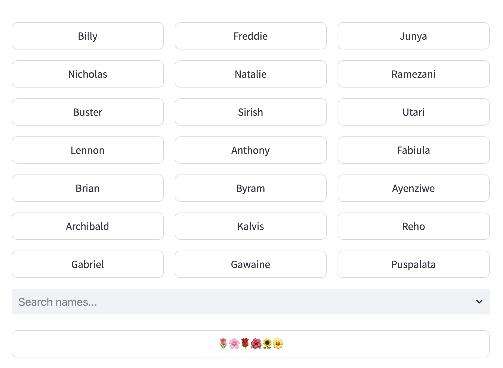
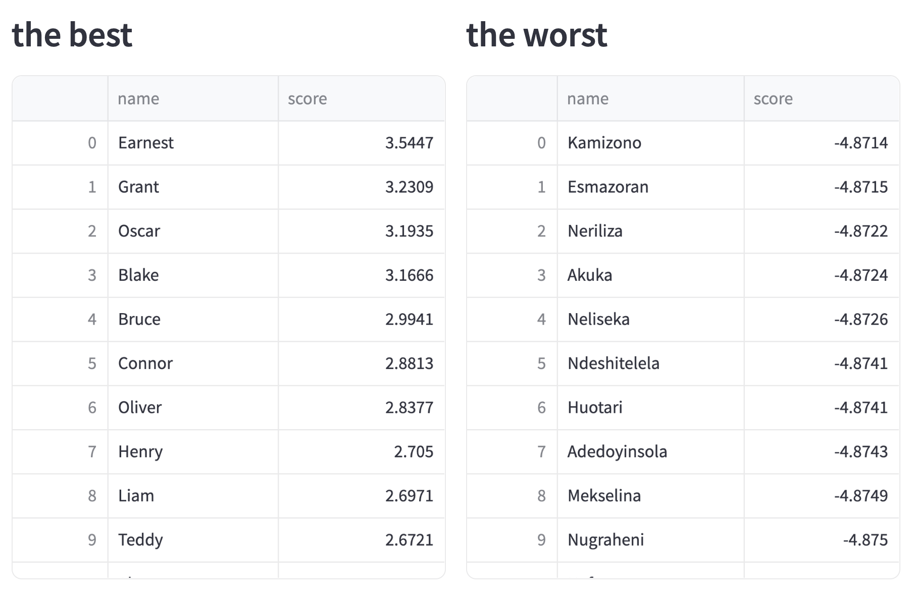

# Earnest

A quick _baby-name preference learning app_ for unabashed data science nerds.

- Uses the names dataset from https://pypi.org/project/names-dataset/
- Converts all the names to 875 wide feature frame comprised of:
  - 1: male prevalence
  - 1: female prevalence
  - 105: country prevalence
  - 768: embedding vector
- By soliciting preferences in repeated 1-vs-20 rounds, learns a ranking
- Displays the top and bottom 50 names

### More on preferences

This is an [Active Learning](https://en.wikipedia.org/wiki/Active_learning_(machine_learning)) approach.
Active Learning is useful when labelling is expensive, but can be prone to feedback loops depending on how the iterations are constructed.
This app presents three columns of names, here referred to as A, B and C, from which the user is to select a single name as the most preferred for the round.

- Column A is sampled from the current top 200 names
- Column B is sampled from the next 800 (200:1000) names
- Column C is sampled uniformly at random

By clicking on a name, the preference is recorded, the model retrained, and the user presented with a new set of names.
There is a search box under the columns to allow selection of a name not listed (useful in bootstrapping the model), and a button filled with flowers that simply resamples using the current model.

### Iterative results

After a few rounds, I've found this model learns a preference relatively quickly.
One imagines the features are quite informative, specifically the embedding vector - which encodes all manner of historical, literate, and cultural associations.
Results are displayed after each round.

### Bias

If your name is in "the worst" list - please don't take it personally!
This model is designed to uncover _your_ preference; mine was clearly
[very Victorian](https://www.bdm.vic.gov.au/popular-baby-names-victoria-2023).
It's worth noting also that the [nomic embedding model](https://www.nomic.ai/blog/posts/nomic-embed-text-v1) used here will also have a bias that reflects the data.

This project is called `Earnest` reflecting the preferences of Gwendolen and Cecily, who preferred that name over Jack or John - but what did this say about their preference for other names?

### Running

- [`pip install names-dataset`](https://pypi.org/project/names-dataset/)
- Install `streamlit_searchbox`, `rapidfuzz` and `xgboost`
- Install [Ollama and the Nomic embed model](https://ollama.com/library/nomic-embed-text)
- Run the `load.pynb` notebook to produce `baby_names_full.pkl`
- Run `streamlit run earnest.py` to launch the interface

### Support

- The code is pretty straight-forward. Best of luck!
